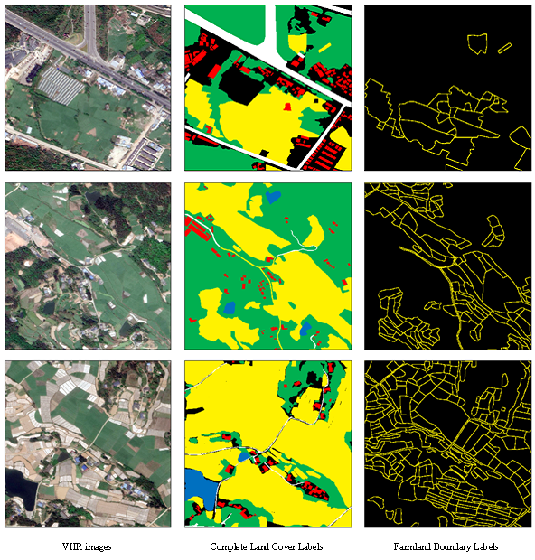

<div align="center">

# Huangtu Dataset: VHR Remote Sensing for Rural Waste Management

[](#citation-section)
[](#download-section)
[](#)
[](#)

*Optimizing Rural Waste Management: Leveraging High-Resolution Remote Sensing and GIS for Efficient Collection and Routing.*

[**📖 Read the Paper**](#citation-section) • [**⬇️ Download Dataset**](#download-section)

</div>

---

## 📸 Visual Teaser
<p align="center">
  
</p>

## 1. Introduction

The **Huangtu Dataset** is explicitly designed to optimize decentralized waste collection and routing models in rural areas with complex geographical features and low population densities. 

The study area covers **Huangtu Town** (31°31ʹ–31°40ʹN, 104°26ʹ–104°33ʹE) in Sichuan Province, Southwest China, spanning $84.54 \text{ km}^2$ with a population of approximately 37,017 residents. The region features a typical, complex topography separated by hills and dam regions across the Anchang and Caoxi River watersheds. Its persistent low population density (~500 people/$\text{km}^2$) makes it highly representative of many rural towns in China, providing a valuable testing ground for evaluating environmental constraints in geospatial frameworks.

This dataset is officially released alongside our research article: *"Optimizing Rural Waste Management: Leveraging High-Resolution Remote Sensing and GIS for Efficient Collection and Routing"*.

## 2. ✨ Highlights & Source Data

- 🛰️ **VHR Imagery:** Sourced from Google Earth Engine (GEE) in 2020 (18-level zoom, RGB bands).
- ⚙️ **Rigorous Preprocessing:** Images underwent stitching, cropping, bit-depth adjustment, reprojection to UTM, and resampling to a precise **1-meter spatial resolution**.
- 🧠 **High-Quality Annotations:** Labels were initially manually annotated, integrated with deep learning semantic segmentation predictions, and finally underwent a rigorous manual refinement process to ensure unparalleled accuracy and completeness.

## 3. Dataset Composition & Label Mapping

The dataset is composed of **30 VHR sample blocks**, each sized at **1000 × 1000 pixels**, comprehensively reflecting the rural landscape across five typical environmental features: buildings, roads, water bodies, farmland, and forests.

To facilitate diverse modeling tasks (e.g., semantic segmentation and boundary detection), the dataset provides two distinct sets of PNG format grayscale labels. The grayscale values map to land cover types as follows:

| Grayscale Value | 🎨 Complete Land Cover Labels | 🚧 Farmland Boundary Labels |
| :---: | :--- | :--- |
| `0` | Background | Background |
| `1` | Buildings | Farmland Boundary |
| `2` | Roads | - |
| `3` | Forests (Green spaces) | - |
| `4` | Farmland | - |
| `5` | Water bodies | - |

> **Note:** Farmland areas are not only represented as polygonal coverage (in Complete Labels) but are further clarified by linear boundary lines (in Boundary Labels) to specify exact geographic limits.

## 4. 📐 Annotation Principles

To ensure consistency, our annotations strictly followed these tailored principles:
1. 🌾 **Farmland:** Includes all boundaries intersecting with farmland areas. Outlines contours closely to visible edges; for connected farmland, only the outermost boundary is marked.
2. 🌲 **Forest:** Outlines match visible contours; for contiguous forested areas, only the outer boundary is annotated.
3. 🏠 **Buildings:** Based strictly on rooftop outlines (ignoring sidewalls/shadows). Connected but visually distinct structures are annotated separately.
4. 🛣️ **Roads:** Annotated along actual edges (ignoring trees/shadows). If a segment is obscured for >20 pixels, it is divided into two separate segments.
5. 💧 **Water Bodies:** Based on clear water edges. Distinct areas separated by barriers (e.g., sandbars, vegetation) are annotated independently.

---

<a id="download-section"></a>
## 5. 📥 Download Links & Structure

You can access the full dataset via the following cloud platforms:

- ☁️ **Baidu Netdisk:** [Click here to access](https://pan.baidu.com/s/1rRB9EmtZdCBsSTrsfWh6yA?pwd=cdut) *(Access Code: `cdut`)*
- ☁️ **Google Drive:** [Click here to access](https://drive.google.com/drive/folders/18wN2XmZPFAia8orKet3-bi0yoP6rO7hp?usp=sharing)

### Directory Structure
The dataset is cleanly organized into three parallel subfolders. Each folder contains 30 corresponding images named in the format `htz_clip[*]`, ensuring perfect alignment for training:

```text
Huangtu_Dataset/
├── VHR Images/                          # 30 RGB images (1000x1000)
│   ├── htz_clip1.png
│   ├── ...
│   └── htz_clip30.png
├── Complete Land Cover Labels/          # Semantic masks (Classes 0-5)
│   ├── htz_clip1.png
│   ├── ...
│   └── htz_clip30.png
└── Farmland Boundary Labels/            # Boundary masks (Classes 0-1)
    ├── htz_clip1.png
    ├── ...
    └── htz_clip30.png
```

<a id="citation-section"></a>
## 6. 📝 Citation

If you find the Huangtu dataset or our research helpful in your work, please consider citing our paper:

**Plain Text:**
> Cheng, X., Yang, J., Han, Z., Shi, G., Pan, D., Meng, L., Zeng, Z., & Shen, Z. (2024). Optimizing rural waste management: Leveraging high-resolution remote sensing and GIS for efficient collection and routing. *International Journal of Applied Earth Observation and Geoinformation*, *135*, 104219. https://doi.org/10.1016/j.jag.2024.104219

**BibTeX:**
```bibtex
@article{CHENG2024104219,
  title = {Optimizing rural waste management: Leveraging high-resolution remote sensing and GIS for efficient collection and routing},
  author = {Xi Cheng and Jieyu Yang and Zhiyong Han and Guozhong Shi and Deng Pan and Likang Meng and Zhuojun Zeng and Zhanfeng Shen},
  journal = {International Journal of Applied Earth Observation and Geoinformation},
  volume = {135},
  pages = {104219},
  year = {2024},
  doi = {https://doi.org/10.1016/j.jag.2024.104219}
}
```

## 7. 🙏 Acknowledgements

We would like to express our sincere gratitude to the **Graduate Quality Engineering Construction Funding Program of Chengdu University of Technology (2024YAL016)** for supporting this project. 

We also heavily acknowledge the efforts of all contributors across multiple institutions:

- **Chengdu University of Technology:** Xi Cheng, Zhiyong Han, Miaomiao Liu, Jieyu Yang, Zhuojun Zeng, Deng Pan
- **Aerospace Information Research Institute (Chinese Academy of Sciences):** Zhanfeng Shen, Haoyu Wang
- **Key Laboratory of Development and Application of Rural Renewable Energy (Ministry of Agriculture, China):** Guozhong Shi